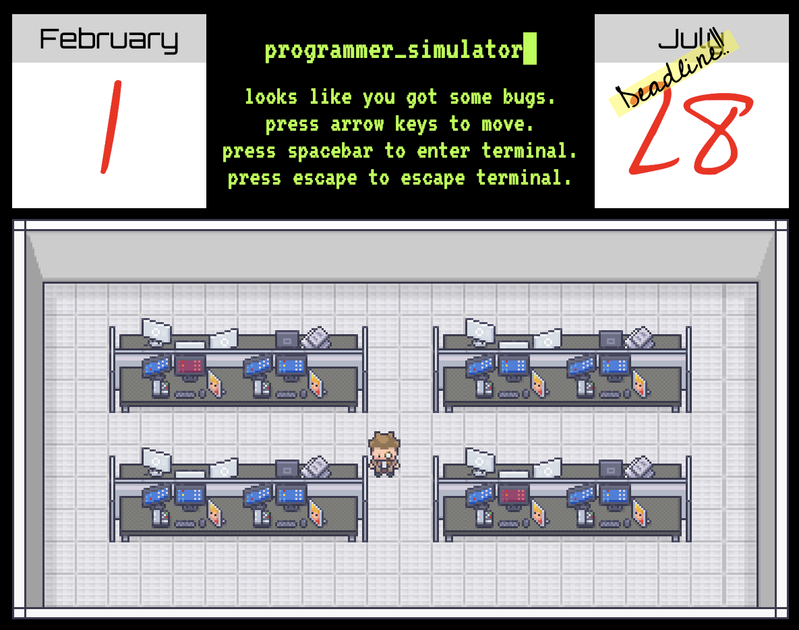
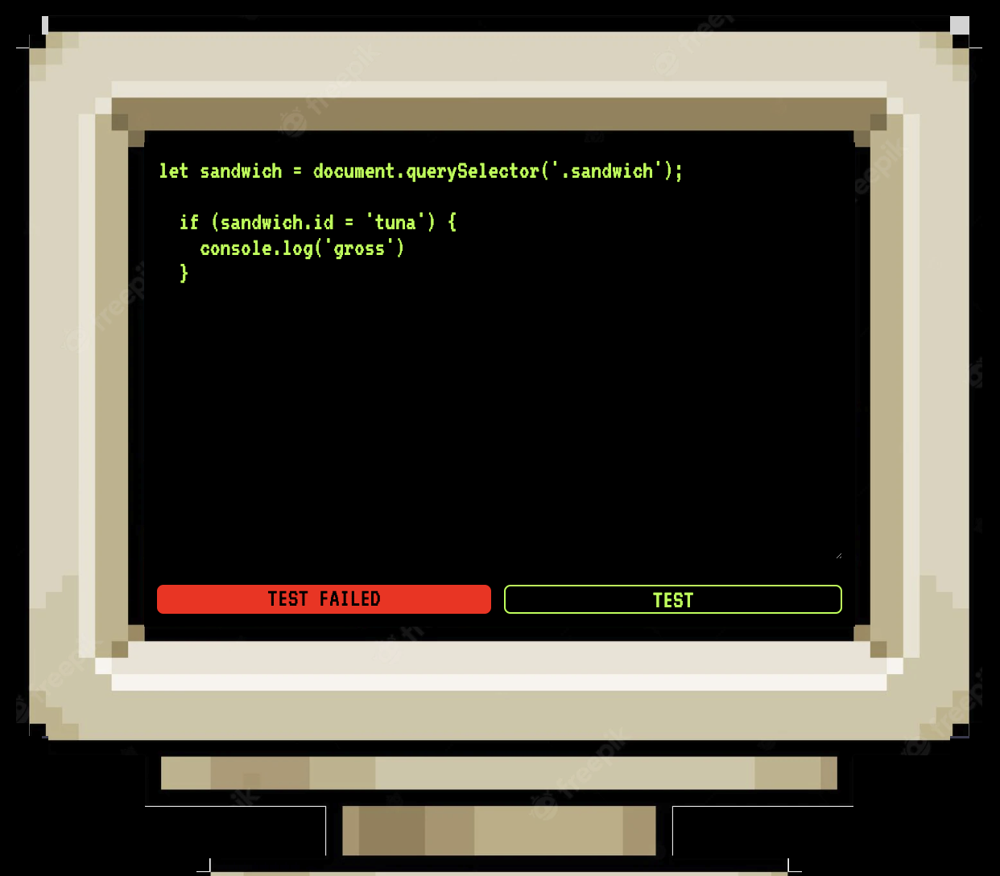

# programmer_simulator

A nerve-racking simulation game, *programmer_simulator* brings you into the life of a full-time programmer. As the player, experience what it is like to frantically debug your code before reaching the dreaded project deadline. Styled as a 2D RPG, this simulation game demands you access various terminals scattered throughout an office space, fixing bugs within them. If the bug has been fixed, the player must merge the code into the company's main branch and move onto the next bug. If the player is able to fix all the bugs before the deadline, they are a worthy employee. If not, (maybe) they can try again next time.

Settings for the amount of bugs to fix and the days (seconds) until the deadline can be adjusted through the start menu.

## [Play the game here](https://programmer-simulator.netlify.app/)

- Start by choosing the days (seconds) you will have to fix all the bugs
- Choose the amount of bugs you will need to fix
- Once the game has started, you can move the sprite with the arrow keys
- When the sprite is in front of and facing the terminal, you may interact with it using the spacebar
- Fix the bug displayed within the terminal and test your solution
- If your solution failed, try another solution; if your solution is correct, merge your code
- You may escape the terminal at any time using the escape key
- Fix all of the bugs before the deadline to win

## Technologies used:

- HTML
- CSS
- JavaScript
- git

## Applications used for asset creation:

- Tiled (for map assets)
- Aseprite (for sprite assets)

## Credits

- Sprite and map assets created by LimeZu (https://limezu.itch.io/).
- Terminal asset created by kaleb-silva (https://www.freepik.com/author/kalebsilva).

## Icebox

- [ ] Organize JavaScript through modules
- [ ] Refactor/Simplify JavaScript
- [ ] Add more bugs to fix within the terminal
- [ ] Create a more immersive/realistic terminal experience
- [ ] Provide more user feedback through styling
- [ ] Add sound effects
- [ ] Create various desk/terminal/map assets for variety
- [ ] Create ability to dynamically place desks/terminals each game
- [ ] Create a round system where the difficulty increases as the player completes more projects (rounds)
- [ ] Allow the player to choose their sprite, choose their difficulty, and practice specific types of common bugs
- [ ] Allow the player the option of solving bugs in their choice of programming language
